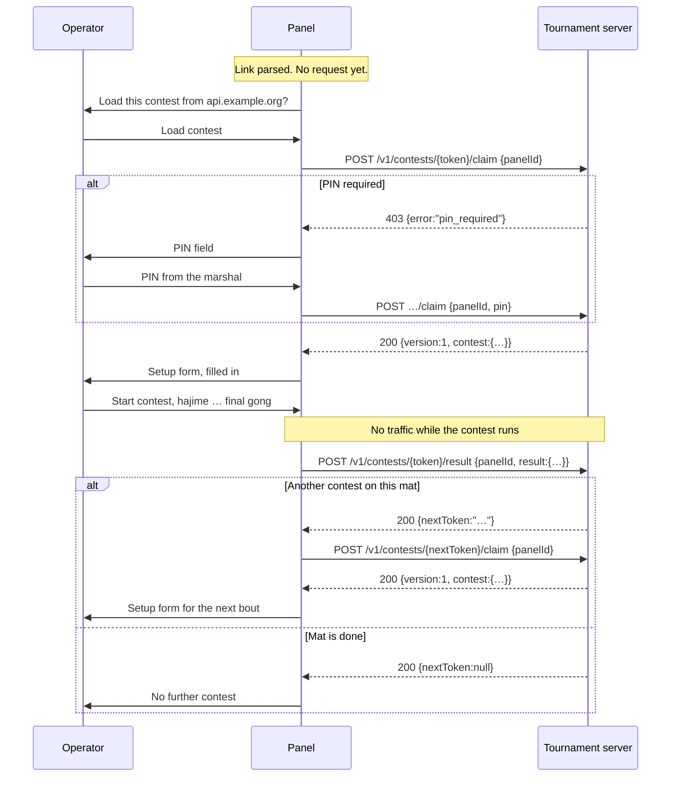

# Tournament server contract

The control panel can be handed a contest by a tournament system, report
the result when that contest ends, and be handed the next contest for the
same mat. This document is the whole interface.

**There is no server in this repository, and none is planned.** The panel
is the client side of a contract; this page is what a server has to
present if it wants the panel to bookend its contests. Everything here is
optional — without a server link the app is exactly what the
[README](../README.md) describes, and makes no network request for
contest data at all.

## Contents

- [What the server does and does not do](#what-the-server-does-and-does-not-do)
- [The opt-in link](#the-opt-in-link)
- [The flow, end to end](#the-flow-end-to-end)
- [Endpoints](#endpoints)
- [Payloads](#payloads)
- [What the panel guarantees](#what-the-panel-guarantees)
- [What the server must do](#what-the-server-must-do)
- [Errors the operator sees](#errors-the-operator-sees)
- [Trying it locally](#trying-it-locally)
- [Where this lives in the code](#where-this-lives-in-the-code)

## What the server does and does not do

The panel talks to the server **only at the edges of a contest**. Between
hajime and the final gong there is no network traffic at all.

The server books the table, records the report, and says who fights next
on this mat. It does not run the contest: the clock, the scores, the
osaekomi, golden score and the hall board are all local, and stay local.

Deliberately out of scope:

- Logging the operator in. There are no accounts.
- Live scores over the network. The hall board is a second browser tab on
  the same machine, synced over `BroadcastChannel`.
- A queue the operator picks from. The server chooses the next contest
  for this mat; the panel never shows a list.
- Controlling more than one mat from one panel.
- Cryptographic proof that a score is honest. The panel is a public
  static app with no secret it could sign with — any key shipped in it
  can be read out of it. The POST is a table report; trust the mat.

## The opt-in link

The tournament system gives the table a link to **the panel**, not to a
page on its own server:

```
https://<panel-host>/<base>/?role=panel&api=https://api.example.org#c=<contest-token>
```

| Piece | Where | Why there |
|---|---|---|
| `role=panel` | query | Unchanged — opens the control panel. |
| `api` | query | Origin, optionally with a path prefix, of the club API. Not a secret. |
| `c` | **hash** | The capability token for one contest. A browser never sends the hash to the panel's own host, so the token stays out of GitHub Pages' access logs. |

The scoreboard link carries neither. That tab never talks to the server —
it is opened from the panel and mirrors it locally.

### What makes `api` acceptable

The panel parses `api` as a URL and takes it only when **all** of these
hold:

- the scheme is `https:`, **or** `http:` with host `localhost` or
  `127.0.0.1` (so a server can be developed on one machine);
- there is no username or password in the URL;
- there is no hash fragment on `api` itself.

Anything else — `http:` on a LAN hostname, `javascript:`, `data:`, a
malformed URL — is refused before any request exists. A trailing slash is
stripped, and the panel then builds every path itself:

```
{api}/v1/contests/{token}/claim
{api}/v1/contests/{token}/result
```

No field in any response can change where the panel sends things. A
`resultUrl`, `nextUrl` or any other host named in a body is ignored.

### What makes a token acceptable

`c` is opaque. The panel never interprets it. It must be non-empty and
must not contain `/`, `?` or `#`, so that it cannot rewrite the path
built around it. The same rule applies to every `nextToken`.

Mint tokens that are random and long. **The token is the ticket:** holding
it is the right to claim that contest and to post its result, so guessing
one must be impractical.

### When the link is incomplete or wrong

If `api` is absent, the hash is ignored entirely and the panel is
standalone. If `api` is present but the token is missing, or `api` fails
validation, the panel says so and carries on as a standalone scoreboard.
It does not guess, and it does not fetch.

## The flow, end to end



In words:

1. **Parse the link.** If it is invalid or incomplete, say so and stay
   standalone. No request.
2. **Work out which contest this is.** If this browser already holds a
   token for this same `api` — a bout in progress, or the next ticket
   after a result — that token is the current contest and the hash is
   ignored. This is what stops a reload at 11am dragging the table back
   to the first bout of the day. Otherwise the hash `c` is the token.
3. **Confirm the host.** The panel shows the parsed hostname and waits.
   Still no request. This happens once per page session; later bouts on
   the same table are not asked again.
4. **Decline is final for the session.** "Continue without server" makes
   the panel standalone: no claim, no report, no next.
5. **Confirm → claim,** sending the origin-wide `panelId`.
6. **A PIN is asked for only when the server asks for it,** and then the
   claim is repeated with it.
7. **After a 200 claim:** if a local contest for *this same token* can be
   resumed, the existing resume prompt appears. Otherwise the ordinary
   setup form opens, filled from the payload. The operator may edit it
   and must submit it — a fresh start here does not open a blank
   unrelated form, because this ticket must not report a made-up bout.
8. **Run the contest.** No further server traffic until it ends.
9. **On `finished`, post the result.** If that fails, the finished screen
   stays and Retry is offered. The local contest is not discarded.
10. **On a 200:** a `nextToken` is persisted, claimed, and becomes the
    next setup form — without a new link and without touching the
    address bar. A `null` means this mat is finished for the day.

`swapSides`, the board theme and the venue logo are never part of this.
They are the table's own choices and stay on the form.

## Endpoints

Everything is `POST`, with `Content-Type: application/json`.

### Claim

```
POST {api}/v1/contests/{token}/claim
```

```json
{ "panelId": "8e29…", "pin": "1234" }
```

`pin` is present only when the operator has been asked for one and typed
something; it is omitted entirely otherwise, never sent as `""`.

| Status | Body | Panel does |
|---|---|---|
| `200` | the [contest payload](#contest-payload-server--panel) | Owns the contest; opens the setup form |
| `200` | anything that fails validation | Treats it as a failed claim, not a blank contest |
| `403` | `{"error":"pin_invalid"}` | Keeps the PIN field, shows *That PIN was not accepted* |
| `403` | anything else | Shows the PIN field |
| `404` | — | *This contest is unknown* |
| `409` | `{"error":"claimed"}` | *Another table already has this contest* |
| `410` | — | *This contest has expired* |
| `5xx`, refused connection, DNS failure | — | *The contest could not be loaded*, with Retry |

A repeat claim of the same token from the same `panelId` must be a `200`.
That is what lets a reloaded panel pick its own contest back up, and how
the operator recovers from an accidental refresh in front of the hall.

### Result

```
POST {api}/v1/contests/{token}/result
```

Body is the [result payload](#result-payload-panel--server). No PIN —
ownership here is the claim.

| Status | Body | Panel does |
|---|---|---|
| `200` | `{"nextToken":"…"}` | Claims that token on the same host |
| `200` | `{"nextToken":null}` | *No further contest*; clears the stored session |
| `200` | no usable `nextToken` | *The answer could not be read*, with Retry |
| `403` | — | *This table has not claimed this contest* |
| `404` | — | *This contest is unknown* |
| `409` | `{"error":"claimed"}` | *Another table owns this contest* |
| `410` | — | *This contest has expired* |
| `5xx`, refused connection | — | *The result was not sent*, with Retry |

**The first accepted report wins.** A repeat from the same `panelId` must
answer `200` and must **not** overwrite. The 200 body still carries
`nextToken`, which is how a lost "load next" is recovered without
inventing a second result.

`nextToken` follows the same rules as `c`: opaque, non-empty, no `/`, `?`
or `#`. It is a token, not a URL, and it is claimed on the `api` the
operator already confirmed.

## Payloads

### Contest payload (server → panel)

```json
{
  "version": 1,
  "contest": {
    "white": { "name": "KOGA Toshihiko", "country": "JPN" },
    "blue":  { "name": "DOUILLET David", "country": "FRA" },
    "category": "-71 kg",
    "durationMs": 240000,
    "round": "FINAL"
  }
}
```

| Field | Required | Notes |
|---|---|---|
| `version` | yes | Must be exactly `1`. Anything else is refused. |
| `white.name`, `blue.name` | yes | Non-empty after trimming. One display string per athlete. |
| `white.country`, `blue.country` | no | Three-letter IJF/IOC code. An unknown code, or none, becomes `IJF`. |
| `category` | no | Free text. Defaults to `""`. |
| `durationMs` | yes | Finite number greater than 0. |
| `round` | no | Free text, e.g. `QUARTER-FINAL`. Defaults to `""`. |

Unknown keys are ignored — that is what lets the server grow — and that
deliberately includes any URL.

**Names are one string**, matching the panel's own state. The board prints
the surname bold and the given name regular, and it tells them apart by
the surname's capitals, the way the IJF writes names: `NERY GAGO Miguel`,
`KIM Se Heon`. The setup form splits the string into two fields for
typing and joins them back, so what the operator submits equals what was
sent unless they edited it.

`durationMs` reaches the form as minutes, and halves are allowed: `90000`
arrives as `1.5`.

### Result payload (panel → server)

```json
{
  "version": 1,
  "panelId": "8e29…",
  "result": {
    "winner": {
      "side": "white",
      "reason": "ippon",
      "causedBy": { "side": "white", "type": "ippon" }
    },
    "white": { "name": "KOGA Toshihiko", "country": "JPN", "ippon": true,  "wazaari": 0, "yuko": 0, "shido": 0 },
    "blue":  { "name": "DOUILLET David", "country": "FRA", "ippon": false, "wazaari": 0, "yuko": 0, "shido": 1 },
    "goldenScore": false,
    "elapsedMs": 125000,
    "durationMs": 240000,
    "category": "-71 kg",
    "round": "FINAL"
  }
}
```

| Field | Notes |
|---|---|
| `winner.side` | `white` or `blue`. Never null on this POST — the panel only sends a finished contest. |
| `winner.reason` | `ippon`, `waza-ari-awasete-ippon`, `waza-ari`, `yuko`, `hansoku-make`. |
| `winner.causedBy` | The action that ended it: `{side, type}` with `type` one of `yuko`, `wazaari`, `ippon`, `shido`. **`null` when the contest was decided on time** rather than by one action. |
| `white` / `blue` | `ippon` is true only for a *direct* ippon. Two waza-ari also end the contest, and show up as `wazaari: 2`. |
| `goldenScore` | Whether the contest went to golden score. |
| `elapsedMs` | Contest time actually used, with mate periods already excluded. **In golden score this is the golden-score time**, because the clock restarts at zero there — `goldenScore` tells you which of the two it is. |
| `durationMs` | The regulation length, whatever happened afterwards. |

The server may store a subset. The panel always sends the full report.

## What the panel guarantees

These are properties of the client, worth knowing when you design the
server around it.

- **TLS is the wire defence.** With an `https:` `api`, a
  man-in-the-middle without a trusted certificate for that name fails the
  request, and `fetch` offers no "continue anyway". Eavesdropping on hall
  Wi-Fi therefore sees that the laptop talked to `api.example.org` — not
  names, scores, tokens or a PIN. During the contest none of those are on
  the wire at all.
- **No request happens before the operator confirms the hostname.** A
  real panel link with a hostile `api` cannot send a table's report
  anywhere on its own.
- **No cookies.** Every request is `credentials: 'omit'`.
- **No `Referer`.** The document declares `no-referrer`, so a link
  followed out of the panel cannot leak the `api` or the token in the
  hash.
- **Tokens after the entry hash never reach the URL.** They are never
  written into `location.hash`, the query string, or history. A stolen
  entry link therefore does not include the rest of the day's queue.
- **The PIN is never stored, never in a URL, and never logged.** It
  exists in the field the operator typed it into and in the body of the
  claim that follows.
- **One `panelId` per browser**, minted with `crypto.randomUUID()` on
  first need and reused for every bout on that machine. Treat it as "this
  table". A React Strict Mode remount does not mint a second one.
- **One result POST per contest per page session.** The panel sends on
  the transition into `finished`, and again only when the operator hits
  Retry.
- **Nothing is cached.** Cross-origin responses are outside the service
  worker's precache, and no runtime caching is configured for `api`.
- **Text is text.** Names and category from the payload are rendered as
  text, never as links, HTML or images.

### What the panel keeps in `localStorage`

| Key | Holds |
|---|---|
| `judo-scoreboard:panel-id` | The `panelId` for this browser |
| `judo-scoreboard:server` | `{ api, token }` — which contest this table currently holds |
| `judo-scoreboard:state` | The contest itself, saved after every change |
| `judo-scoreboard:msg` | Fallback sync channel, only on browsers without `BroadcastChannel` |

The session is a key of its own rather than a field inside the saved
contest, so adding it did not move the persisted schema version — a
deploy mid-tournament does not discard an in-progress bout.

## What the server must do

A checklist for whoever implements the other side:

- [ ] Serve over **HTTPS** with a certificate valid for the `api` host.
- [ ] Allow **CORS** for the panel's origin, on `POST` and on the
      `OPTIONS` preflight that `Content-Type: application/json`
      triggers. Allow the `Content-Type` request header.
- [ ] Mint **random, long, unguessable tokens**, one per contest, with no
      `/`, `?` or `#`.
- [ ] Implement `POST /v1/contests/{token}/claim` and
      `POST /v1/contests/{token}/result` under whatever path prefix `api`
      names.
- [ ] Bind a contest to the **first** `panelId` that claims it; answer a
      different `panelId` with `409`. Answer the **same** `panelId` with
      `200` every time.
- [ ] Make the result **write-once**: keep the first report, answer
      retries `200` with the same `nextToken`, never overwrite.
- [ ] Decide `nextToken` per mat, and return `null` when that mat is
      finished.
- [ ] Optionally require a **PIN** for the first claim — said by the
      marshal or printed on the mat list, never in the link. Answer
      `403 {"error":"pin_required"}` until one arrives and
      `403 {"error":"pin_invalid"}` when it is wrong.
- [ ] Handle **expiry** (`410`), rate limiting, and an administrative
      "release this mat" control. The panel only surfaces the errors; a
      `409` is not something the operator can undo from the panel.

## Errors the operator sees

The hall board never shows any of these. While the next contest is in
setup, the board follows the panel as it always does.

| Situation | Operator sees |
|---|---|
| Incomplete or invalid link | *This link is incomplete* / *cannot be used*, then the ordinary setup |
| Operator declines the host | Standalone, with no further chrome |
| Network or 5xx on claim | *The contest could not be loaded* — Retry, Continue without server |
| `404` / `410` on claim | *This contest is unknown* / *has expired* |
| `409` on claim | *Another table already has this contest* |
| Unreadable contest payload | *That contest could not be read* |
| `pin_required` / `pin_invalid` | The PIN field, with *That PIN was not accepted* on a retry |
| Network or 5xx on result | *The result was not sent* — the contest is still there, Retry |
| `403` on result | *This table has not claimed this contest* |
| `409` on result | *Another table owns this contest* |
| Result `200`, next claim fails | *Retry next contest* — never a second result |
| `nextToken: null` | *No further contest* |

## Trying it locally

`http://localhost` and `http://127.0.0.1` are the two hosts the panel
accepts without TLS, so a server under development needs no certificate.
Start the panel with `npm run dev` and open:

```
http://localhost:5173/judo-scoreboard/?role=panel&api=http://localhost:8787#c=tok_1
```

A stub only has to answer the two endpoints and the CORS preflight to
drive the whole flow: claim → setup form → contest → result → next claim
→ `nextToken: null`.

## Where this lives in the code

| File | Responsibility |
|---|---|
| [`src/server/parseLink.ts`](../src/server/parseLink.ts) | Validates `api` and `#c` |
| [`src/server/payload.ts`](../src/server/payload.ts) | Reads the contest payload, builds the result report |
| [`src/server/session.ts`](../src/server/session.ts) | `panelId`, the stored token, resume rules |
| [`src/server/client.ts`](../src/server/client.ts) | The two `fetch` calls and their status mapping |
| [`src/server/setupSeed.ts`](../src/server/setupSeed.ts) | Contest payload → setup-form fields |
| [`src/ui/ServerNotice.tsx`](../src/ui/ServerNotice.tsx) | Confirm, PIN and error screens |
| [`src/ui/PanelRoot.tsx`](../src/ui/PanelRoot.tsx) | The gate, the claim, the report, the next bout |

Each module under `src/server/` has a test file beside it; they inject
`fetch` and never touch the network. The scoring engine, the
`BroadcastChannel` sync, the scoreboard tab and the GitHub Pages deploy
are untouched by any of this.
